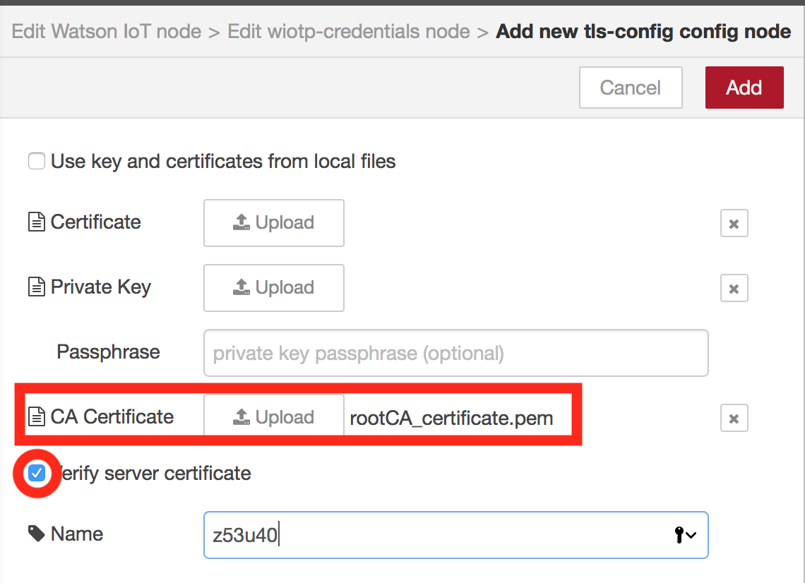

*Quick links :*
[Home](/README.md) - [Part 1](/part1/README.md) - [**Part 2**](/part2/README.md) - [Part 3](/part3/README.md) - [Part 4](/part4/README.md)
***
**Part 2** - [Device Registration](/part2/DEVICE.md) - [Application](/part2/APP.md) - [**Server Certificate**](/part2/CERT1.md) - [Client Certificate](/part2/CERT2.md)
***

# Adding secure communication between the device and IoT Platform using SSL/TLS

## Lab Objectives

In this Lab you will modify MQTT to use a secure connection.  You will learn:

- How to add SSL/TLS capability to the network connection that MQTT uses
- How to generate certificates to enable secure connections using OpenSSL
- How to add the certificates to the IBM Watson IoT Platform
- How to add the certificate to the Watson IoT nodes

### Introduction

Having unsecured traffic for an IoT solution is not a good idea, so in this lab you will see how to create your own certificates and add them to the IoT platform.  You sill also see how to configure device connectivity security on the IoT platform

When using SSL/TLS you can verify the certificate(s) presented by the server if you have the certificate of the Root Certificate Authority used to sign the server certificate.  Your Laptop will have common root CA certificates installed as part of the OS or browser so web traffic can be secured and the padlock on your browser can be shown.  However, you need to add any certificate to IoT devices if you want to verify server certificates.

The Watson IoT nodes include the platform default server certificate, which can be used for most purposes.  The Watson IoT Platform certificate is available on [this](https://console.bluemix.net/docs/services/IoT/reference/security/connect_devices_apps_gw.html#connect_devices_apps_gw) page.

The Watson IoT platform does allow you to replace the certificates used for MQTT traffic, so in this exercise you will generate your own self-signed certificates, add them to the Watson IoT platform and the Node-RED flow, to enable a SSL/TLS connection with the server certificate verified against the root CA certificate added to the Watson IoT node configuration.

The platform [documentation](https://console.bluemix.net/docs/services/IoT/reference/security/set_up_certificates.html#set_up_certificates) provides information about what information must be contained in certificates to work with the platform.

In the prerequisite section you installed the OpenSSL tool, which allows you to work with certificates.  I have provided 2 configuration files in the [certificates](/certificates) folder of this git repo. You need to download them and have them in the directory you will use to generate the certificates.  If you have cloned or downloaded the repo, then I suggest you work in the certificates directory.

### Step 1 - Generating a root Certificate Authority Key and Certificate

You will start by generating a root CA key and certificate.  This will then be used to sign a server certificate.

You Raspberry Pi should have the openssl tools installed by default, so complete the openssl instructions in a terminal on your Raspberry Pi.

In a command windows enter the following commands, you need to replace some values, so do not just copy and paste the commands as shown, or your certificates will not work!

You may choose to create a file and copy the instructions into the file then edit the file so you can copy and paste the commands to run them.

```bash
openssl genrsa -aes256 -passout pass:password123 -out rootCA_key.pem 2048

openssl req -new -sha256 -x509 -days 3560 -subj "/C=GB/ST=DOR/L=Bournemouth/O=z53u40/OU=z53u40 Corporate/CN=z53u40 Root CA" -extensions v3_ca -set_serial 1 -passin pass:password123 -key rootCA_key.pem -out rootCA_certificate.pem -config ext.cfg

openssl x509 -outform der -in rootCA_certificate.pem -out rootCA_certificate.der

xxd -i rootCA_certificate.der rootCA_certificate.der.h
```

replacing:

- C=GB : GB is a country code , so use your own country (CA=Canada, US=USA, .....)
- ST=DOR : DOR is an English county, replace with appropriate state/county/region
- L=Bournemouth : Bournemouth is an English town, replace with appropriate location
- O=z53u40 : z53u40 is the Organisation ID for my IoT Platform
- OU=z53u40 Corporate : z53u40 is the Organisation ID for my IoT Platform
- CN=z53u40 Root CA : z53u40 is the Organisation ID for my IoT Platform
- pass:password123 : password123 is the password that will protect the key - if you change this value do not forget what you entered, as you need it when using the key later.

This generates the key and protects it with a password.  A public certificate is then generated in pem format, which is then converted to der format.  Finally the xxd command creates a header file which allows the certificate to be embedded in code - this can be useful for devices that don't have a file system.

### Step 2 - Uploading the root CA Certificate to the IoT Platform

You need to load the root CA certificate into the IoT platform using the console.  In the settings section goto to CA Certificates in the Security section.  Select to **Add certificate** then select the rootCA_certificate.pem file you just generated to upload to the platform, then press **Save**.

### Step 3 - Generating a Server key and certificate

Now you have a Root Certificate Authority key and certificate, they can be used to sign other certificates that can be verified using the root CA certificate.

You need to edit file [srvext.cfg](/certificates/srvext.cfg), which you should have retrieved from the certificates folder in this git repo.  You need to change the **subjectAltName** entry to match the DNS entry of your instance of the Watson IoT platform, so change the host part of the URL to your Organisation Id:

`subjectAltName = DNS:z53u40.messaging.internetofthings.ibmcloud.com`

To generate a certificate for the IoT platform to use run the following commands:

```bash
openssl genrsa -aes256 -passout pass:password123 -out mqttServer_key.pem 2048

openssl req -new -sha256 -days 3560 -subj "/C=GB/ST=DOR/L=Bournemouth/O=z53u40/OU=z53u40/CN=z53u40.messaging.internetofthings.ibmcloud.com" -passin pass:password123 -key mqttServer_key.pem -out mqttServer_crt.csr

openssl x509 -days 3560 -in mqttServer_crt.csr -out mqttServer_crt.pem -req -sha256 -CA rootCA_certificate.pem -passin pass:password123 -CAkey rootCA_key.pem -extensions v3_req -extfile srvext.cfg -set_serial 11

openssl x509 -outform der -in mqttServer_crt.pem -out mqttServer_crt.der

xxd -i mqttServer_crt.der mqttServer_crt.der.h
```

again substituting values for C=, ST=, L=, O=, OU= and CN=, but this time it is important that the CN value is the URL of your instance of the IoT messaging URL, which is the Organisation ID followed by **.messaging.internetofthings.ibmcloud.com**, which should also match the **subjectAltName** field in the [srvext.cfg](/certificates/srvext.cfg) file.

The commands above generate a new key for the server, creates a certificate request for the server, issues the certificate and signs it with the root CA key, saving it as a pem file.  The certificate is converted from pem to der format and lastly the xxd command creates a header file to embed the certificate in code.

### Step 4 - Add the server certificate to the IoT Platform

Now you have the server certificate you can upload to the IoT platform in the settings section of the console in the Messaging Server Certificates section under Security.  Select to **Add Certificate** then upload the certificate (mqttServer_crt.pem) and private key (mqttServer_key.pem).  You need to also provide the password you provided when creating the key (password123).  Once the certificate is uploaded you enable it by setting the Currently Active Certificate to your key.

Your can test the server certificate by using openssl:

```
openssl s_client -CAfile <CA certificate pem file> -showcerts -state  -servername <org ID>.messaging.internetofthings.ibmcloud.com -connect <org ID>.messaging.internetofthings.ibmcloud.com:8883
```

replace <CA certificate pem file> with the name of the CA root certificate and <org ID> with the 6 character org ID for your instance of the IOT Platform.

### Step 5 - Adding the root CA certificate to the Watson IoT flow

Open the Watson IoT node configuration and select to add SSL/TLS configuration then edit the SSL/TLS config to create a new configuration.


Upload the Root CA certificate in pem format and select to verify the server certificate.




### Step 6 - Adding the root CA certificate to your OS or browser

Finally you need to add the root CA certificate to your OS or browser, as the IoT Platform console uses a secure connection to get data required to populate and update the console in your browser.  If you don't add the root CA Certificate then the console will not show any data.

If using Firefox you need to import the rootCA_certificate.pem file, by accessing the security section of the preferences.  On some platform there is an Advanced option before you are able to view certificates, then there is an option to import certificates then trust to identify web sites.

If using Chrome it depends on the platform.  On some platforms Chrome uses the system certificates, but on others it manages its own certificates and then like Firefox you need to go into the security settings to import the certificate authority certificate and trust it to identify web sites.

To add the root CA certificate to OS:

- **Linux**: Many browsers on Linux do not use the OS certificates but manage their own certificate store, so check before adding the certificate to the OS store.  If you do need to add the rootCA certificate to the OS ca certificate store, then unfortunately there is not a standard way on Linux to achieve this.  Each distro has a slightly different approach, but many want the certificate to be a .crt file, so use the following command to convert the .pem to .crt: `openssl x509 -outform der -in rootCA_certificate.pem -out rootCA_certificate.crt`
  - Debian: With admin privileges copy the rootCA_certificate.crt file to /usr/share/ca-certificates then run `dpkg-reconfigure ca-certificates`
  - Fedora: Copy the rootCA_certificate.pem file to **/etc/pki/ca-trust/source/anchors/** (using sudo mv or other root access) then run command `update-ca-trust extract` with admin privileges.
  - Ubuntu: Copy the rootCA_certificate.crt to **/usr/local/share/ca-certificates** using admin privileges then run `update-ca-certificates`.
- **MacOS**: Double click the certificate in Finder to open it in the Keychain Access app.  It will automatically show as not trusted.  Double click it to open up the certificate details window and then expand the **Trust** section.  Change the SSL value to **Always Trust**.  Close the certificate window (you will be prompted for your account password to verify the change).
- **Windows**: Launch the Microsoft Management Console (enter mmc in the start menu), then select *File* ->* Add/Remove Snap-in...*. Highlight Certificates and press **Add**.  Select to manage certificates for **Computer account**, **Local computer** then press **Finish** then **OK**.  Back in the mmc, select the Certificates item in the left column then right-click the **Trusted Root Certificate Authorities** item.  From the popup menu select *All Tasks* -> *Import...* to launch the Certificate Import Wizard.  Select the rootCA_certificate pem or der file (may need to alter filter to show all files) and place it in the **Trusted Root Certificate Authorities** store.

***
*Quick links :*
[Home](/README.md) - [Part 1](/part1/README.md) - [**Part 2**](/part2/README.md) - [Part 3](/part3/README.md) - [Part 4](/part4/README.md)